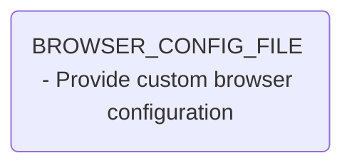
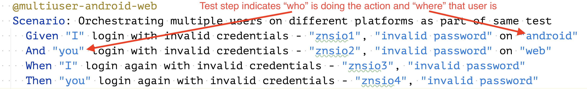
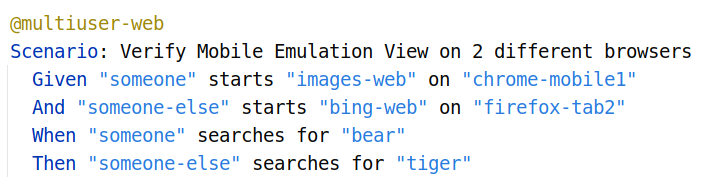

[](https://jitpack.io/#znsio/teswiz)
[](https://jitci.com/gh/znsio/teswiz)
[](https://github.com/znsio/teswiz/actions/workflows/CI.yml)
[](https://github.com/znsio/teswiz/actions/workflows/codeql-analysis.yml)


# Important changes:




# What is this repository about?

This repository implements automated tests for Android & iOS apps, specified using cucumber-jvm and intelligently run
them against

* Android
* iOS
* Windows Apps
* Web

Applitools (https://applitools.com/) Visual AI, and Applitools Ultrafast Grid (https://applitools.com/product-ultrafast-test-cloud/) is integrated with this framework, to provide Visual AI testing as part of functional automation.

Reports will be uploaded to reportportal.io, that you would need to setup separately, and provide the server details in
src/test/resources/reportportal.properties file or provide the path to the file using this environment
variable: `REPORT_PORTAL_FILE`

Test can run on local browsers / devices, or against any cloud provider, such as HeadSpin, BrowserStack, SauceLabs, pCloudy. 

## Tech stack used

* cucumber-jvm (https://cucumber.io)
* AppiumTestDistribution (https://github.com/AppiumTestDistribution/AppiumTestDistribution) -manages Android and iOS
  devices, and Appium
* Appium (https://appium.io)
* WebDriver (https://selenium.dev)
* reportportal.io (https://reportportal.io)
* Applitools (https://applitools.com)
* Build tool: gradle 7.3.3

## Getting Started, or how can you use teswiz?
It is very easy to use teswiz in your framework.
Follow these steps:
1. Setup the prerequisites mentioned below [https://github.com/znsio/teswiz#prerequisites]
1. Using your favorite IDE (I use IntelliJ Idea Community Edition), create a new Java-Gradle project 
1. Copy build.gradle.sample file to your newly created project's root folder and rename it to build.gradle
1. Create capabilities.json in some folder - ex: ./capabilities - refer to src/test/resources/com/znsio/e2e/features/android/caps/capabilities.json
1. Create config.properties in some folder - ex: ./configurations and provide default values - refer to src/test/resources/com/znsio/e2e/features/android/configs/config.properties
1. Update the **run** task in build.gradle with appropriate values for config.properties, pathToStepDef, pathToFeaturesDir, pathToLogProperties   
1. Refer to the **Running the tests** section

## Prerequisites

* JDK
  * **Minimum JDK version: 11**
  * **Set JAVA_HOME environment variable**
  * You can install JDK from here: https://adoptopenjdk.net/
* Setup the Android environment for test execution:
  * **Set ANDROID_HOME environment variable**
  * **Refer to this post for instructions how to automatically setup your environment - https://applitools.com/blog/automatic-appium-setup/**
  * Additional References:
    * Setup Android Command-line tools and SDK - https://developer.android.com/studio#command-tools
    * Install appium - https://appium.io
* Appium Desktop App is a great way to identify locators, and the recorder is quite helpful to quickly identify multiple
  locators for your tests - https://github.com/appium/appium-desktop/releases/tag/v1.20.2. You can also use Katalon
  Studio for locator identification (especially helpful for Windows platform)
* To verify appium installation is successful, run
  `appium-doctor` - it should not report any errors
* To install reportportal on local machine, refer to https://reportportal.io/installation. (Docker setup is the easiest way to proceed).

## Running the tests

### Run on Android

To run all the tests against the Android platform, run the following command:

    PLATFORM=android ./gradlew run

#### Run on Local devices:

The framework, by default, automatically figures out if there are multiple devices connected to the machine, and if so,
will run the tests in parallel

#### Run on pCloudy's Device Farm:

**To enable running the tests on pCloudy's Device Farm, the following additional environment variables need to be provided:**

* `RUN_IN_CI=true` - Default is `false`
* `CLOUD_USER` - pCloudy username
* `CLOUD_KEY` - pCloudy password

Sample command:

    PLATFORM=android RUN_IN_CI=true CLOUD_USER=myusername CLOUD_KEY=abcd1234abcd ./gradlew run

For other cloud configurations, refer here: https://github.com/AppiumTestDistribution/AppiumTestDistribution

### Run on iOS

    PLATFORM=iOS ./gradlew run

### Run on Windows

    PLATFORM=windows ./gradlew run

### Run on Web

    PLATFORM=web ./gradlew run

### Running Multi-User simulations

The framework now supports running multiuser scenarios. This means 1 cucumber scenario can orchestrate the interaction between multiple instances of the application-under-test in multiple platforms - ex: Android and Web

Example:



In the above example
You can run these tests as below:

#### To run tests on **android & web** platforms

    TAG=@multiuser-android-web

**_Current restriction - 1 android device & max 2 web browsers_**

#### To run tests on **web** platforms

    TAG=@multiuser-web-web 

**_Current restriction - max 2 web browsers_**

### Running Multi-User scenarios in Mobile Emulation View of Web Browsers

The framework now supports launching web browsers in Mobile Emulation View.
Instead of passing simple browser names in steps like 'chrome', 'firefox', etc, 
you can pass more informative parameters like 'chrome-mobile1', 'safari-mobile2', etc

These informative parameters refer to Browser Config json file for actual device names

Example:



## Additional configurations

### Running the tests with Applitools Visual AI

**To enable Applitools Visual Testing in your test execution, the following additional environment variables need to be
provided:**

* `IS_VISUAL=true` - to enable Visual Testing using Applitools
* `APPLITOOLS_API_KEY=<API_KEY>` - Sets the API key as provided by Applitools
* To run Visual Tests against dedicated Applitools instance, add a property serverUrl in applitools_config.json.
  Ex: "serverUrl": "https://eyesapi.applitools.com"
  * By Default, the free public Applitools cloud will be used

**To enable Applitools Ultrafast Grid, follow these steps:**

* In applitools_config.json, set`useUFG": true`
* In applitools_config.json, set `testConcurrency": 5` to the appropriate concurrency level as per your Applitools 
  license
* In RunCukesTest file, or any file where you have your custom hooks, add the following lines:

```
import com.applitools.eyes.selenium.*;
import com.applitools.eyes.visualgrid.model.*;
```

In beforeScenario, add the specific browser and device configurations to `Configuration` and add that to the 
TestExecutionContext - `context` as shown below:
```
@Before
public void beforeTestScenario (Scenario scenario) {
    LOGGER.info(String.format("ThreadID: %d: in overridden beforeTestScenario%n", Thread.currentThread().getId()));
    Configuration ufgConfig = new Configuration();
    ufgConfig.addBrowser(1024, 1024, BrowserType.CHROME);
    ufgConfig.addBrowser(1024, 1024, BrowserType.FIREFOX);
    ufgConfig.addDeviceEmulation(DeviceName.iPhone_X, ScreenOrientation.PORTRAIT);
    ufgConfig.addDeviceEmulation(DeviceName.OnePlus_7T_Pro, ScreenOrientation.LANDSCAPE);
    context.addTestState(APPLITOOLS.UFG_CONFIG, ufgConfig);
}
```

IF you have `useUFG` set to `true`, and if you do not specify the Ultrafast Grid configuration, then teswiz has a 
default set of browser and devices specified which will be used for Visual Validation. The default configuration is 
shown below:

```
  ufgConfig.addBrowser(1024, 1024, BrowserType.CHROME);
  ufgConfig.addBrowser(1024, 1024, BrowserType.FIREFOX);
  ufgConfig.addBrowser(1024, 1024, BrowserType.SAFARI);
  ufgConfig.addBrowser(1024, 1024, BrowserType.EDGE_CHROMIUM);
  ufgConfig.addBrowser(1600, 1200, BrowserType.CHROME);
  ufgConfig.addBrowser(1600, 1200, BrowserType.FIREFOX);
  ufgConfig.addBrowser(1600, 1200, BrowserType.SAFARI);
  ufgConfig.addBrowser(1600, 1200, BrowserType.EDGE_CHROMIUM);
  ufgConfig.addDeviceEmulation(DeviceName.iPhone_X, ScreenOrientation.PORTRAIT);
  ufgConfig.addDeviceEmulation(DeviceName.iPad_Pro, ScreenOrientation.LANDSCAPE);
  ufgConfig.addDeviceEmulation(DeviceName.Nexus_5X, ScreenOrientation.PORTRAIT);
  ufgConfig.addDeviceEmulation(DeviceName.Nexus_6P, ScreenOrientation.LANDSCAPE);
```

### Running a subset of tests:

To run a subset of tests, for a given platform, the following additional environment variables need to be provided:

* `TAG=@schedule` - This will run all tests tagged with the platform name provided, except tests tagged as "@wip"
* `TAG="@schedule and @signup"` - This will run all tests tagged with the name **schedule AND signup** for the platform
  name provided, except tests tagged as "@wip"
* `TAG="@schedule or @signup"` - This will run all tests tagged with the name **schedule OR signup** for the platform
  name provided, except tests tagged as "@wip"

Sample commands:

    PLATFORM=android TAG=@schedule ./gradlew run`

    PLATFORM=android TAG="@schedule and @signup" ./gradlew run`

    PLATFORM=android TAG="@schedule or @signup" ./gradlew run`

### Using a different apk for execution (Android):

To run tests using a specific apk (instead of the one specified in caps/capabilities.json, OR,
caps/pcloudy_capabilties.json, the following additional environment variable need to be provided:

* `APP_PATH='<path to apk>'`

Sample command:

    APP_PATH=~/Downloads/MyLatestApp.apk PLATFORM=android ./gradlew run

## Configuration parameters
The config.properties file has the following properties. Highlighting the defaults, and options for each here. 

These can be overridden by providing the same either as environment variables or system properties. 

    # ATD properties
    RUNNER=distribute -> ATD property. We will always use distributed
    FRAMEWORK=cucumber -> ATD property. We will always use cucumber
    RUNNER_LEVEL=methods -> ATD property. We will always use methods
    CAPS=./caps/capabilities.json -> Path to capabilties.json file

    # teswiz configuration properties. Can be overridden using environment variables or system properties

    APP_NAME=teswiz -> Name of your application
    APP_PACKAGE_NAME=io.cloudgrey.the_app -> android app package name
    APP_PATH=./temp/abc.apk -> path to android / windows app name
    APPLITOOLS_CONFIGURATION=./configs/applitools_config.json -> Applitools configuration 
    BASE_URL_FOR_WEB=BASE_URL -> Key name of the property in TEST_DATA_FILE for environment specific base url
    BROWSER=chrome -> Which browser to use for Web execution? Supported: chrome || firefox
                      Browsers should to be installed. Corresponding WebDriver for the browser will be downloaded automatically
    BUILD_ID=BUILDID -> The key name of the environment variable that has the corresponding build id of the test execution
    CLEANUP_DEVICE_BEFORE_STARTING_EXECUTION=true -> Uninstall app from local Android devices before starting test execution
    CLOUD_KEY=<auth / api key> for pCloudy / Headspin
    CLOUD_USER=<username / email> for pCloudy -> Not required for Headspin
    CLOUD_NAME=headspin|pCloudy -> REQUIRED when running against pCloudy / Headspin
    CLOUD_UPLOAD_APP=false -> Upload the app to pCloudy / headspin before running the tests
    DEVICE_LAB_URL=<root url for device farm>
    ENVIRONMENT_CONFIG_FILE=./src/test/resources/environments.json -> Environment specific configuration file
    IS_VISUAL=false -> Should enable Applitools Visual Testing? If yes, set to true
    LOG_DIR=target -> Where should logs be created?
    LOG_PROPERTIES_FILE=./src/test/resources/log4j.properties -> log4j configuration file
    MAX_NUMBER_OF_APPIUM_DRIVERS -> The max number of drivers on cloud to create for multiuser android tests, default value is 5
    MAX_NUMBER_OF_WEB_DRIVERS -> The max number of web drivers on cloud to create for multiuser web tests, default value is 5
    PLATFORM=android -> Run tests against? Supported: android | iOS | windows | web
    PARALLEL=1 -> How many tests should be run in parallel?
    PROXY_KEY=HTTP_PROXY -> If proxy should be set, what is the environment variable specifying the proxy?
    PROXY_URL=<proxy_url> -> What is the proxy url to be used if PROXY_KEY is set
    WEBDRIVER_MANAGER_PROXY_KEY=HTTP_PROXY -> If proxy should be used for WebDriverManager, what is the environment variable specifying the proxy?
    WEBDRIVER_MANAGER_PROXY_URL=<proxy_url> -> What is the proxy url to be used for WebDriverManager if WEBDRIVER_MANAGER_PROXY_KEY is set
    REMOTE_WEBDRIVER_GRID_PORT=<environment variable name which holds the port to be used for RemoteWebDriver>
    REPORT_PORTAL_FILE=src/test/resources/reportportal.properties -> ReportPortal.io configuration
    RUN_IN_CI=false -> Are tests running in CI?
    TARGET_ENVIRONMENT=prod -> Which environment are the tests running against? Should map to envrionments specified in ENVIRONMENT_CONFIG_FILE
    TEST_DATA_FILE=./src/test/resources/testData.json -> Environment specific static test data
    BROWSER_CONFIG_FILE=./src/test/resources/com/znsio/e2e/features/configs/browser_config.json -> json containing browser configurations

## Troubleshooting / FAQs

### Setting Environment Variables:

You can set environment variables

From Mac OSX or Linux:

    export PLATFORM=android

From Windows:

    set PLATFORM=android
