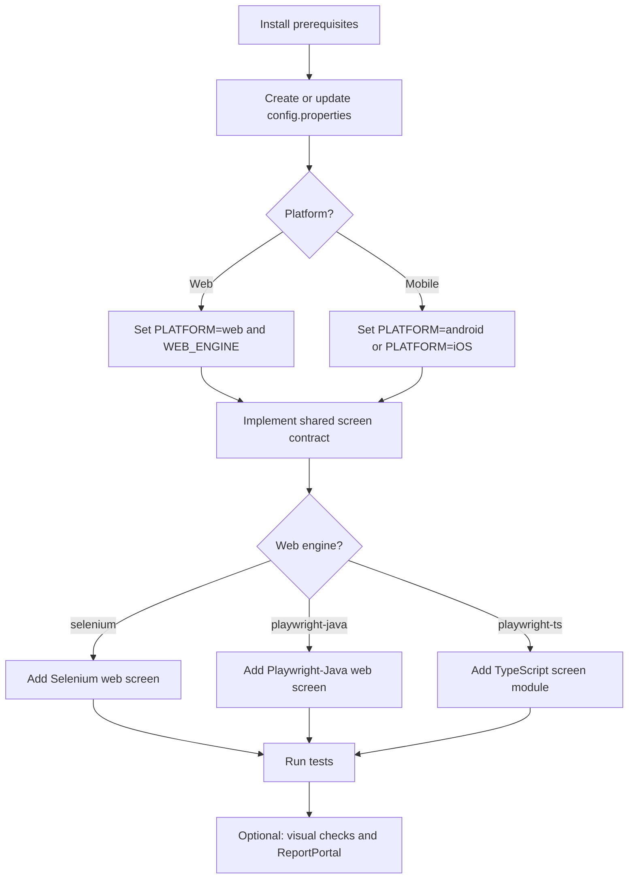

[](https://github.com/anandbagmar/teswiz)
[](https://github.com/anandbagmar/teswiz/stargazers)
[](https://github.com/anandbagmar/teswiz/pulls)
[](https://github.com/anandbagmar/teswiz/network)

## Status

[](https://jitpack.io/#anandbagmar/teswiz)
[](https://github.com/anandbagmar/teswiz/actions/workflows/Build_And_Run_Unit_Tests_CI.yml)
[](https://github.com/anandbagmar/teswiz/actions/workflows/codeql-analysis.yml)
[](https://jitpack.io/#anandbagmar/teswiz)

# teswiz

teswiz is a Java-first automation framework for:

- web: Selenium, Playwright-Java, Playwright-TS
- mobile: Appium Java for Android and iOS
- desktop/web-adjacent: Electron, Windows apps, PDF validation
- visual testing: Applitools Eyes and Ultrafast Grid
- reporting: Cucumber HTML, ReportPortal, engine-aware artifacts

The test authoring style stays the same:

`feature -> steps -> business layer -> screen contract`

teswiz handles persona routing, session lifecycle, platform selection, cloud execution, and reporting underneath that flow.

## Important upgrade notes

Read these before upgrading or enabling Playwright:

1. Web engine selection is explicit.
   `WEB_ENGINE` now supports `selenium`, `playwright-java`, and `playwright-ts`.
   Checked-in sample web configs should set this explicitly, even though the runtime still defaults to `selenium` when omitted.
2. Playwright is opt-in, not a replacement.
   Existing Selenium suites continue to work. To use Playwright, choose the engine and add the matching screen implementation.
3. Playwright screen model differs by engine.
   `playwright-java` uses Java screen implementations.
   `playwright-ts` uses TypeScript screen modules under `src/test/resources/playwright/screens`.
4. Older context imports changed in `1.0.13+`.
   Replace `com.context.*` imports with `com.znsio.teswiz.context.*`.
5. Playwright web on HeadSpin is intentionally unsupported.
   teswiz now fails fast with an explicit message if that combination is selected.

Detailed guidance:

- [Breaking changes](docs/internals/BreakingChanges-README.md)
- [Playwright migration guide](docs/internals/Playwright-Migration-Guide.md)
- [Architecture notes](docs/internals/Architecture-README.md)

## Get started


```mermaid
flowchart TD
    A["Install prerequisites"] --> B["Create or update config.properties"]
    B --> C{"Platform?"}
    C -->|Web| D["Set PLATFORM=web and WEB_ENGINE"]
    C -->|Mobile| E["Set PLATFORM=android or PLATFORM=iOS"]
    D --> F["Implement shared screen contract"]
    E --> F
    F --> G{"Web engine?"}
    G -->|selenium| H["Add Selenium web screen"]
    G -->|playwright-java| I["Add Playwright-Java web screen"]
    G -->|playwright-ts| J["Add TypeScript screen module"]
    H --> K["Run tests"]
    I --> K
    J --> K
    K --> L["Optional: visual checks and ReportPortal"]
```

Recommended reading order:

1. [Prerequisites](docs/guides/Prerequisites-README.md)
2. [Getting started](docs/guides/GettingStartedUsingTeswiz-README.md)
3. [Configure test execution](docs/guides/ConfiguringTestExecution-README.md)
4. [Write your first test](docs/guides/WritingFirstTest-README.md)
5. [Sample tests](docs/guides/SampleTests-README.md)

## Choose your web engine

Set this in your suite config:

```properties
WEB_ENGINE=selenium
```

Valid values:

- `selenium`
- `playwright-java`
- `playwright-ts`

Use:

- `selenium` when you want the current Selenium web path
- `playwright-java` when you want Playwright web with Java screen implementations
- `playwright-ts` when you want Playwright web with TypeScript screen modules

Examples:

- [Selenium web example](docs/examples/Web-Selenium-Example.md)
- [Playwright-Java web example](docs/examples/Web-Playwright-Java-Example.md)
- [Playwright-TS web example](docs/examples/Web-Playwright-TS-Example.md)
- [Android example](docs/examples/Android-Example.md)
- [iOS example](docs/examples/iOS-Example.md)

## Common commands

```bash
./gradlew clean build
./gradlew verifyScreenContracts
./gradlew reportMissingScreenContracts
```

If you need a fresh dependency resolution:

```bash
./gradlew clean build -PforceUpdate=true
```

Notes:

- use JDK 17 or higher
- run `verifyScreenContracts` explicitly when adding or migrating screens
- use `-PincludeMissingScreenTargets=true` with `verifyScreenContracts` when you want stricter coverage reporting

## Visual testing and reporting

teswiz supports:

- Applitools Eyes for Selenium web, Playwright-Java web, Playwright-TS web, and mobile visual flows
- Applitools Ultrafast Grid for web visual runs
- ReportPortal publishing with engine, platform, provider, persona, and session metadata
- unified scenario artifacts such as screenshots, traces, console logs, HARs, and provider links

Read more:

- [Running visual tests](docs/features/RunningVisualTests-README.md)
- [ReportPortal setup](docs/features/ReportPortal-README.md)
- [Configuration parameters](docs/features/ConfigurationParameters-README.md)

## Architecture

The high-level architecture is documented separately in:

- [Architecture notes](docs/internals/Architecture-README.md)

That doc covers:

- Java orchestration layer
- Selenium, Playwright-Java, and Playwright-TS web engines
- Appium mobile execution
- screen resolution and contract verification
- cloud/provider adapters
- reporting and visual integration

## CI notes

For GitHub Actions in this repo:

- use `actions/setup-node` before Node-based installs
- use `npm ci` in CI workflows
- commit `package-lock.json` whenever `package.json` dependencies or overrides change
- install Playwright browsers only in workflows that actually execute Playwright
- keep only the latest artifact set per workflow for user-created branches
- do not retain artifacts for dependency-management branches such as `dependabot/*` or `renovate/*`

## Contributing

If you are adding or migrating screen implementations:

1. keep the screen contract stable
2. add the engine/platform-specific implementation
3. run `./gradlew verifyScreenContracts`
4. add or update the relevant sample/docs if user-facing behavior changed
