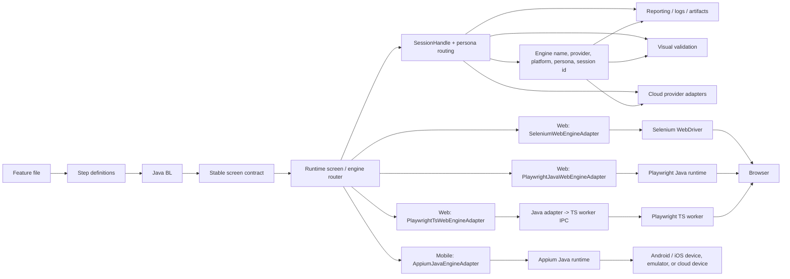
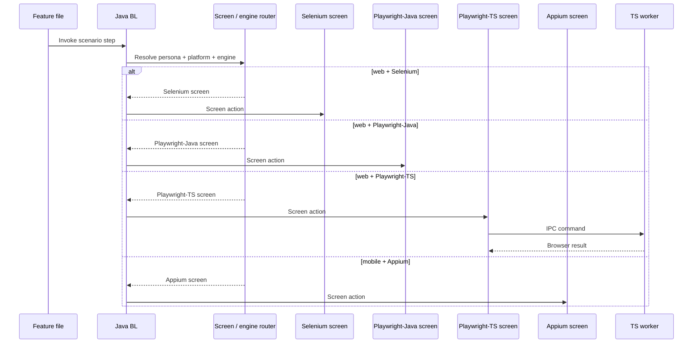
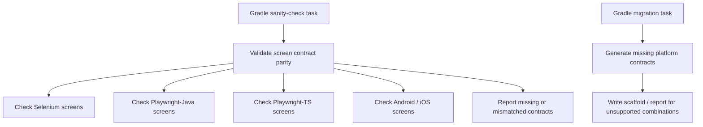

# teswiz Architecture Notes

This document describes the current package intent for teswiz after the dual-engine web refactor.

## Engine architecture

teswiz treats web and mobile execution as first-class variants behind one shared business-facing contract.
The execution choice is persona-scoped and session-scoped, so multi-user scenarios can mix engines safely.

The complete runtime picture is:

Execution routing is still persona-scoped, and the same scenario can involve multiple engines or platforms:

Explicit sanity-check and migration-support tasks are part of the architecture:

Assumptions used by this architecture:

* the screen contract stays stable across supported platform and engine combinations
* the BL layer never calls TypeScript directly
* Playwright-TS remains a Java-owned orchestration path with a TS worker at the execution boundary
* Selenium Java continues to work as it does today
* multi-user and multi-platform routing remains persona/session-driven
* engine-specific behavior belongs in engine-specific screen implementations, not in BL

## Upgrade and migration impact

* Existing Selenium Java tests continue to run unchanged
* No migration script is required for Selenium-only suites
* Playwright Java and Playwright TS adoption is opt-in
* If a suite wants to use a Playwright engine, it must select the engine explicitly and use the corresponding screen implementation once introduced
* If a suite stays on Selenium Java, no code or configuration migration is needed beyond keeping its current config in place

## Stable framework-facing package

`com.znsio.teswiz.runner`

Keep these as the primary framework entry points unless there is a deliberate breaking-change decision:

* `Driver`
* `Drivers`
* `Runner`
* `Setup`
* `Visual`

These classes act as the stable Java-owned orchestration layer for:

* scenario lifecycle
* driver/session orchestration
* config access
* visual orchestration
* integration points already used by client projects

## Internal support packages

### `com.znsio.teswiz.session`

Owns session metadata and persona/session registries.

Current examples:

* `SessionHandle`
* `UserPersonaDetails`

### `com.znsio.teswiz.config.browser`

Owns browser-config parsing and Playwright-specific browser-config evolution.

Current examples:

* `BrowserConfigLoader`
* `PlaywrightBrowserConfig`
* `PlaywrightBrowserConfigResolver`
* `PlaywrightBrowserConfigMigrator`
* `PlaywrightBrowserConfigMigrationReporter`

### `com.znsio.teswiz.mobile.provider`

Owns provider-aware mobile execution behavior extracted from Appium orchestration, starting with cloud report-link publication.

Current examples:

* `MobileExecutionProvider`
* `MobileExecutionProviderResolver`
* `LocalMobileExecutionProvider`
* `BrowserStackMobileExecutionProvider`
* `LambdaTestMobileExecutionProvider`
* `HeadSpinMobileExecutionProvider`
* `PCloudyMobileExecutionProvider`
* `LambdaTestMobileAppUpload`
* `BrowserStackMobileCapabilitySetup`
* `HeadSpinMobileCapabilitySetup`
* `LambdaTestMobileCapabilitySetup`
* `PCloudyMobileCapabilitySetup`

### `com.znsio.teswiz.web`

Owns shared web-engine concepts.

Current examples:

* `WebEngine`

### `com.znsio.teswiz.web.provider`

Owns provider-aware web execution behavior such as session naming, status updates, and provider identity for local and cloud runs.

Current examples:

* `WebExecutionProvider`
* `WebExecutionProviderResolver`
* `LocalWebExecutionProvider`
* `BrowserStackWebExecutionProvider`
* `LambdaTestWebExecutionProvider`
* `HeadSpinWebExecutionProvider`

### `com.znsio.teswiz.web.provider.selenium`

Owns Selenium-specific cloud capability setup extracted from `runner` so provider-specific web capability building can evolve without bloating orchestration classes.

Current examples:

* `BrowserStackWebSetup`
* `LambdaTestWebSetup`
* `BrowserStackWebCapabilitySetup`
* `LambdaTestWebCapabilitySetup`

### `com.znsio.teswiz.web.browser`

Owns browser-engine orchestration that chooses Selenium or Playwright web execution.

Current examples:

* `BrowserDriverManager`
* `WebDriverSessionResult`

### `com.znsio.teswiz.web.selenium`

Owns Selenium web engine runtime internals used by teswiz.

Current examples:

* `SeleniumDriverManager`

### `com.znsio.teswiz.web.playwright`

Owns the Playwright TS worker bridge and Selenium-compatible driver facade used internally by teswiz.

Current examples:

* `PlaywrightWorkerClient`
* `PlaywrightWorkerManager`
* `PlaywrightWorkerResponse`
* `PlaywrightWorkerSession`
* `PlaywrightWebDriver`
* `PlaywrightWebElement`
* `PlaywrightLocator`
* `PlaywrightLocatorReference`

### `com.znsio.teswiz.reporting`

Owns reporting-side adapters that turn engine/session state into uniform teswiz artifacts.

Current examples:

* `ScenarioArtifactReporter`

### `com.znsio.teswiz.visual`

Owns engine-specific visual helper implementations that support `runner.Visual`.

Current examples:

* `PlaywrightVisualCheckSettingsMapper`

## Package rules

When adding new code for the dual-engine architecture:

* do not dump new engine-specific support classes into `runner` by default
* keep `runner` focused on stable orchestration-facing APIs
* prefer browser-engine orchestration code under `web.browser`
* prefer Selenium web engine code under `web.selenium`
* prefer engine-specific code under `web.playwright`
* prefer provider-specific web execution code under `web.provider`
* prefer Selenium web cloud capability setup under `web.provider.selenium`
* prefer provider-specific Appium/mobile cloud behavior under `mobile.provider`
* prefer reporting adaptation code under `reporting`
* prefer browser-config evolution code under `config.browser`
* prefer visual-engine adaptation code under `visual`

## Consumer compatibility intent

The goal is to keep teswiz non-breaking for normal Selenium Java users by preserving:

* feature-file style
* config keys
* execution flow
* stable `runner` entry points

Client projects should avoid importing internal support packages unless teswiz explicitly documents them as supported extension APIs.
