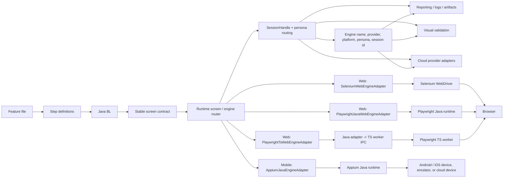
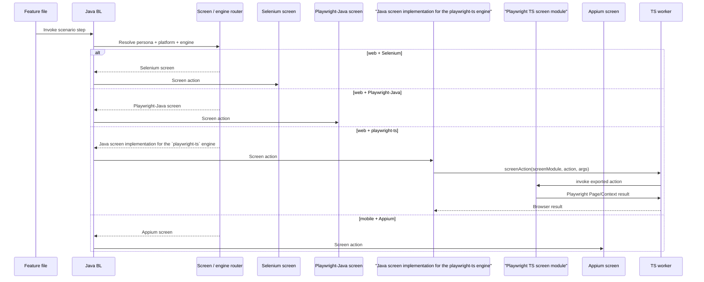
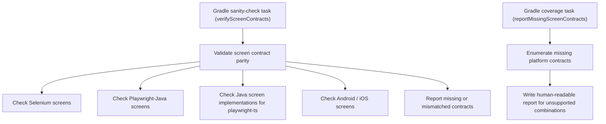

# teswiz Architecture Notes

This document describes the current package intent for teswiz after the dual-engine web refactor.

## Engine architecture

teswiz treats web and mobile execution as first-class variants behind one shared business-facing contract.
The execution choice is persona-scoped and session-scoped, so multi-user scenarios can mix engines safely.

The complete runtime picture is:

```mermaid
flowchart LR
    F[Feature file] --> S[Step definitions]
    S --> BL[Java BL]
    BL --> SC[Stable screen contract]
    SC --> ROUTER[Runtime screen / engine router]

    ROUTER --> SH[SessionHandle + persona routing]
    SH --> REP[Reporting / logs / artifacts]
    SH --> VIS[Visual validation]
    SH --> CLOUD[Cloud provider adapters]

    ROUTER --> WSEL[Web: SeleniumWebEngineAdapter]
    ROUTER --> WPJ[Web: PlaywrightJavaWebEngineAdapter]
    ROUTER --> WPTS[Web: PlaywrightTsWebEngineAdapter]
    ROUTER --> MAPP[Mobile: AppiumJavaEngineAdapter]

    WSEL --> WD[Selenium WebDriver]
    WPJ --> PWJ[Playwright Java runtime]
    WPTS --> IPC[Java adapter -> TS worker IPC]
    IPC --> PWT[Playwright TS worker]
    MAPP --> APP[Appium Java runtime]

    WD --> B[Browser]
    PWJ --> B
    PWT --> B
    APP --> D[Android / iOS device, emulator, or cloud device]

    SH --> META[Engine name, provider, platform, persona, session id]
    META --> REP
    META --> VIS
    META --> CLOUD
```

Execution routing is still persona-scoped, and the same scenario can involve multiple engines or platforms:

```mermaid
sequenceDiagram
    participant Feature as Feature file
    participant BL as Java BL
    participant Router as Screen / engine router
    participant Se as Selenium screen
    participant PJ as Playwright-Java screen
    participant PT as "Java screen implementation for the playwright-ts engine"
    participant TS as "Playwright TS screen module"
    participant App as Appium screen
    participant Worker as TS worker

    Feature->>BL: Invoke scenario step
    BL->>Router: Resolve persona + platform + engine
    alt web + Selenium
        Router-->>BL: Selenium screen
        BL->>Se: Screen action
    else web + Playwright-Java
        Router-->>BL: Playwright-Java screen
        BL->>PJ: Screen action
    else web + playwright-ts
        Router-->>BL: Java screen implementation for the `playwright-ts` engine
        BL->>PT: Screen action
        PT->>Worker: screenAction(screenModule, action, args)
        Worker->>TS: invoke exported action
        TS->>Worker: Playwright Page/Context result
        Worker-->>PT: Browser result
    else mobile + Appium
        Router-->>BL: Appium screen
        BL->>App: Screen action
    end
```

Explicit sanity-check and migration-support tasks are part of the architecture:

```mermaid
flowchart TD
    G["Gradle sanity-check task (verifyScreenContracts)"] --> C[Validate screen contract parity]
    C --> S1[Check Selenium screens]
    C --> S2[Check Playwright-Java screens]
    C --> S3["Check Java screen implementations for playwright-ts"]
    C --> S4[Check Android / iOS screens]
    C --> R[Report missing or mismatched contracts]

    M["Gradle coverage task (reportMissingScreenContracts)"] --> B[Enumerate missing platform contracts]
    B --> OUT[Write human-readable report for unsupported combinations]
```

Assumptions used by this architecture:

* the screen contract stays stable across supported platform and engine combinations
* the BL layer never calls TypeScript directly
* Playwright-TS remains a Java-owned orchestration path with a TS worker at the execution boundary
* test-owned Playwright-TS screen modules live under `src/test/resources/playwright/screens`
* Selenium Java continues to work as it does today
* multi-user and multi-platform routing remains persona/session-driven
* engine-specific behavior belongs in engine-specific screen implementations, not in BL
* framework capabilities that are not real UI screens, such as PDF validation, should live in `src/main` framework classes rather than test-side screen contracts
* runtime screen resolution and user-facing screen verification/reporting infrastructure should ship from `src/main`, while sample contracts and framework self-tests can remain in `src/test`

## Pattern matrix

The dual-engine and multi-platform design intentionally uses a small set of patterns.
The table below maps each pattern to the current teswiz implementation and the planned end-state as Playwright-Java and Playwright-TS become first-class web engines.

| Pattern | Why teswiz uses it | Current teswiz examples | Planned / expanding examples |
| --- | --- | --- | --- |
| [Facade](https://refactoring.guru/design-patterns/facade) | Keep framework-facing entry points stable while hiding engine details | `Runner`, `Drivers`, `BrowserDriverManager`, `Visual` | Keep the same facade layer stable while web engines multiply |
| [Strategy](https://refactoring.guru/design-patterns/strategy) | Select engine or provider at runtime by config and platform | `WEB_ENGINE`, `WebExecutionProviderResolver`, `MobileExecutionProviderResolver` | `selenium`, `playwright-java`, `playwright-ts` as peer web strategies |
| [Adapter](https://refactoring.guru/design-patterns/adapter) | Normalize different runtimes behind the teswiz contract | `PlaywrightWebDriver`, `BrowserStackWebExecutionProvider`, `LambdaTestWebExecutionProvider` | `SeleniumWebEngineAdapter`, `PlaywrightJavaWebEngineAdapter`, `PlaywrightTsWebEngineAdapter`, Appium-side mobile adapters |
| [Proxy / Remote Proxy](https://refactoring.guru/design-patterns/proxy) | Let Java call Playwright-TS while execution happens in a separate worker | `PlaywrightWorkerClient`, `PlaywrightWorkerManager`, TS worker IPC | Keep Playwright-TS as a Java-owned orchestration path with a remote execution boundary |
| [Factory](https://refactoring.guru/design-patterns/factory-method) | Create engine-specific sessions and screen implementations without exposing creation logic to tests | `Drivers.createDriverFor(...)`, `ScreenRegistry.getScreen(...)`, `PlaywrightWorkerManager.createManagedSession(...)` | Config-driven screen factories and engine factories for Selenium, Playwright-Java, Playwright-TS, and Appium |
| [Abstract Factory](https://refactoring.guru/design-patterns/abstract-factory) | Choose the correct family of screen implementations for a given platform and engine | Partially present today in screen `get()` methods and platform branching | Explicit engine-aware screen factories for shared screen contracts |
| [Bridge](https://refactoring.guru/design-patterns/bridge) | Keep the business-facing screen contract stable while allowing different underlying engine implementations | Current screen abstractions plus platform-specific screen classes | Shared screen contract implemented by Selenium, Playwright-Java, Playwright-TS, Android, and iOS variants |
| [Session Object](https://martinfowler.com/eaaCatalog/serverSessionState.html) | Route personas through explicit session metadata instead of raw driver ownership | `SessionHandle`, `UserPersonaDetails` | Expand session-aware routing uniformly across Selenium, Playwright-Java, Playwright-TS, Appium, and cloud providers |
| [DTO / Result Object](https://martinfowler.com/eaaCatalog/dataTransferObject.html) | Return engine-created runtime state without letting engine packages own framework objects | `WebDriverSessionResult` | Similar result objects for engine session creation and artifact capture where needed |
| [Ports and Adapters](https://alistair.cockburn.us/hexagonal-architecture) | Keep the Java core as the orchestration layer and push vendor/runtime specifics to the edges | `web.provider`, `mobile.provider`, Playwright worker bridge, browser/provider/session packages | Stronger engine-boundary contracts for Selenium, Playwright-Java, Playwright-TS, Appium, and cloud providers |
| [Dependency Injection](https://martinfowler.com/articles/injection.html) via functions / suppliers | Make internal seams testable without turning concrete helpers into extension points | `PlaywrightWorkerManager` injected worker factory, browser-config lookup, provider-name supplier | Continue replacing subclass-based test seams with smaller injected contracts |
| [Contract verification](https://martinfowler.com/bliki/ContractTest.html) | Prevent engine or platform implementations from drifting away from the shared screen/business contract | Focused shared web-driver contract tests today | Planned Gradle sanity-check task for engine/platform screen contract parity |

Patterns teswiz is intentionally moving away from:

* inheritance-heavy extension seams for internal helpers
* hidden mutable context side effects for engine/session transfer
* engine-specific behavior leaking into BL classes
* giant all-purpose interfaces instead of smaller, composable engine contracts

## Upgrade and migration impact

* Existing Selenium Java tests continue to run unchanged
* No migration script is required for Selenium-only suites
* Playwright Java and Playwright TS adoption is opt-in
* If a suite wants to use a Playwright engine, it must select the engine explicitly and use the corresponding screen implementation once introduced
* If a suite stays on Selenium Java, no code or configuration migration is needed beyond keeping its current config in place

## Stable framework-facing package

`com.znsio.teswiz.runner`

Keep these as the primary framework entry points unless there is a deliberate breaking-change decision:

* `Driver`
* `Drivers`
* `Runner`
* `Setup`
* `Visual`

These classes act as the stable Java-owned orchestration layer for:

* scenario lifecycle
* driver/session orchestration
* config access
* visual orchestration
* integration points already used by client projects

## Internal support packages

### `com.znsio.teswiz.session`

Owns session metadata and persona/session registries.

Current examples:

* `SessionHandle`
* `UserPersonaDetails`

### `com.znsio.teswiz.config.browser`

Owns browser-config parsing and Playwright-specific browser-config evolution.

Current examples:

* `BrowserConfigLoader`
* `PlaywrightBrowserConfig`
* `PlaywrightBrowserConfigResolver`
* `PlaywrightBrowserConfigMigrator`
* `PlaywrightBrowserConfigMigrationReporter`

### `com.znsio.teswiz.mobile.provider`

Owns provider-aware mobile execution behavior extracted from Appium orchestration, starting with cloud report-link publication.

Current examples:

* `MobileExecutionProvider`
* `MobileExecutionProviderResolver`
* `LocalMobileExecutionProvider`
* `BrowserStackMobileExecutionProvider`
* `LambdaTestMobileExecutionProvider`
* `HeadSpinMobileExecutionProvider`
* `PCloudyMobileExecutionProvider`
* `LambdaTestMobileAppUpload`
* `BrowserStackMobileCapabilitySetup`
* `HeadSpinMobileCapabilitySetup`
* `LambdaTestMobileCapabilitySetup`
* `PCloudyMobileCapabilitySetup`

### `com.znsio.teswiz.web`

Owns shared web-engine concepts.

Current examples:

* `WebEngine`

### `com.znsio.teswiz.web.provider`

Owns provider-aware web execution behavior such as session naming, status updates, and provider identity for local and cloud runs.

Current examples:

* `WebExecutionProvider`
* `WebExecutionProviderResolver`
* `LocalWebExecutionProvider`
* `BrowserStackWebExecutionProvider`
* `LambdaTestWebExecutionProvider`
* `HeadSpinWebExecutionProvider`
* `WebCloudSessionMetadataResolver`
* `WebSessionMetadataBuilder`

### `com.znsio.teswiz.web.provider.selenium`

Owns Selenium-specific cloud capability setup extracted from `runner` so provider-specific web capability building can evolve without bloating orchestration classes.

Current examples:

* `BrowserStackWebSetup`
* `LambdaTestWebSetup`
* `BrowserStackWebCapabilitySetup`
* `LambdaTestWebCapabilitySetup`

### `com.znsio.teswiz.web.provider.playwright`

Owns normalized provider-aware Playwright execution configuration so `playwright-java` and `playwright-ts` can receive the same provider metadata and endpoint details without pushing cloud conditionals back into `runner`.

Current examples:

* `PlaywrightExecutionProviderConfig`
* `PlaywrightExecutionProviderConfigResolver`

### `com.znsio.teswiz.web.browser`

Owns browser-engine orchestration that chooses Selenium or Playwright web execution.

Current examples:

* `BrowserDriverManager`
* `WebDriverSessionResult`

### `com.znsio.teswiz.web.selenium`

Owns Selenium web engine runtime internals used by teswiz.

Current examples:

* `SeleniumDriverManager`

### `com.znsio.teswiz.web.playwright`

Owns the Playwright TS worker bridge and Selenium-compatible driver facade used internally by teswiz.

Current examples:

* `PlaywrightWorkerClient`
* `PlaywrightWorkerManager`
* `PlaywrightWorkerResponse`
* `PlaywrightWorkerSession`
* `PlaywrightWebDriver`
* `PlaywrightWebElement`
* `PlaywrightLocator`
* `PlaywrightLocatorReference`

### `com.znsio.teswiz.reporting`

Owns reporting-side adapters that turn engine/session state into uniform teswiz artifacts.

Current examples:

* `ScenarioArtifactReporter`

Current reporting behavior includes:

* `scenario-session-metadata.json` for per-scenario session metadata
* `scenario-session-summary.txt` for quick human-readable session summaries
* shared publication of Playwright trace, HAR, and console artifacts
* ReportPortal log messages for web cloud provider report links when session metadata includes provider-native report details
* HTML report classifications aggregated from scenario metadata, including personas, platforms, engines, providers,
  and when available, provider-native cloud session ids and provider report URLs

### `com.znsio.teswiz.visual`

Owns engine-specific visual helper implementations that support `runner.Visual`.

Current examples:

* `PlaywrightVisualCheckSettingsMapper`

## Package rules

When adding new code for the dual-engine architecture:

* do not dump new engine-specific support classes into `runner` by default
* keep `runner` focused on stable orchestration-facing APIs
* prefer browser-engine orchestration code under `web.browser`
* prefer Selenium web engine code under `web.selenium`
* prefer engine-specific code under `web.playwright`
* prefer provider-specific web execution code under `web.provider`
* prefer Selenium web cloud capability setup under `web.provider.selenium`
* prefer provider-specific Appium/mobile cloud behavior under `mobile.provider`
* prefer reporting adaptation code under `reporting`
* prefer browser-config evolution code under `config.browser`
* prefer visual-engine adaptation code under `visual`

## Consumer compatibility intent

The goal is to keep teswiz non-breaking for normal Selenium Java users by preserving:

* feature-file style
* config keys
* execution flow
* stable `runner` entry points

Client projects should avoid importing internal support packages unless teswiz explicitly documents them as supported extension APIs.
