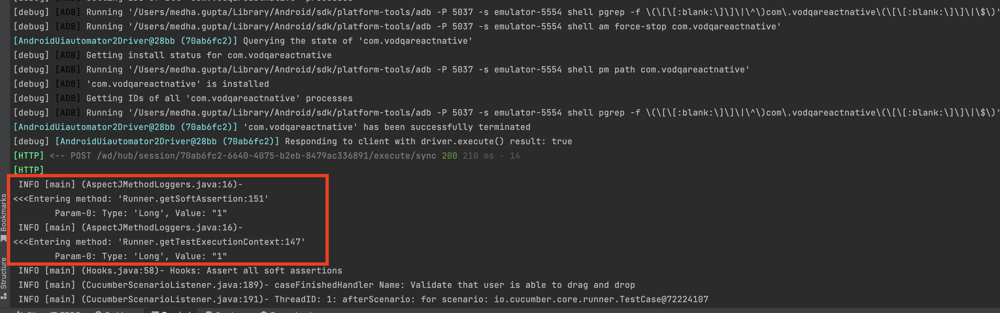

# Setting Up AspectJ auto logging with Teswiz:

With below AspectJ Local configurations, we can add auto logging for methods.

#### 1. Create a new aspect java class by using `@aspect` annotation before class name

```
@Aspect
public class AspectLogging {
    methodName(){}
}
```
#### 2. Add Pointcut to define the scope for auto-Logging using `@Pointcut` annotation
```
@Pointcut("execution(public * *.*(..))"")
    public void executionScope(){
    }
```
For more detail regarding pointcut visit: https://docs.spring.io/spring-framework/docs/2.0.x/reference/aop.html

#### 3. Add `@Before` and `@After` annotation to add loggers before and after method execution
```
    @Before("executionScope()")
    public void beforeAnyMethod(JoinPoint joinPoint) {
        AspectJMethodLoggers.beforeAnyMethod(joinPoint);
    }

    @After("executionScope()")
    public void afterAnyMethod(JoinPoint joinPoint) {
        AspectJMethodLoggers.afterAnyMethod(joinPoint);
    }
```

### Test Result
Once the AspectJ implementation is done execute a simple test case then observe the loggers in the console.


Implementation Reference: https://github.com/znsio/teswiz/blob/main/src/test/java/com/znsio/teswiz/aspect/AspectLogging.java
