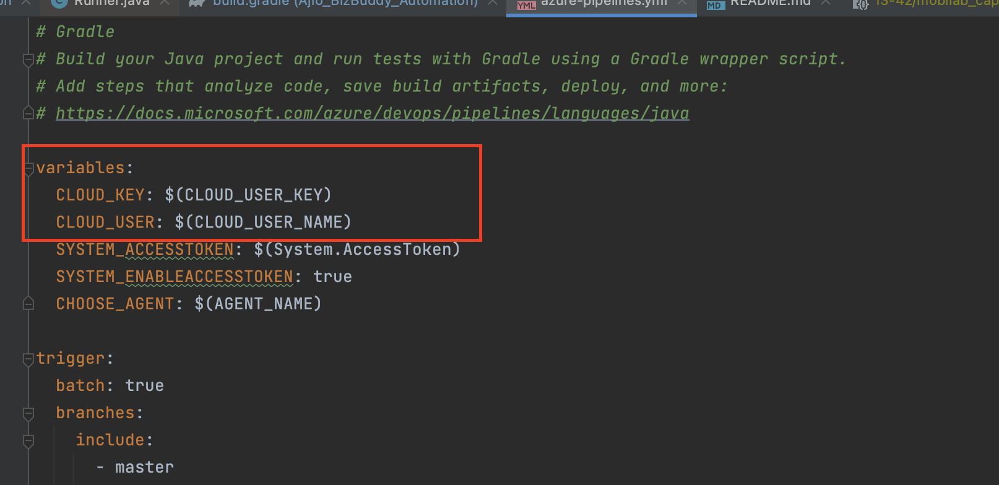

# Setting Up Browser-Stack with Teswiz:

With below BrowserStack Local configurations, we can test the mobile apps those hosted on localhost, behind proxies and firewalls efficiently.

### Use the Teswiz version: 2665b0d517 or latest testwiz version from https://jitpack.io/#znsio/teswiz

#### Put these capabilities and config files in capabilities and config folder as per the project requirements.

* browserstack_capabilities.json(https://github.com/znsio/teswiz/blob/main/caps/theapp_browserstack_capabilities.json) 

* browserstack_config.properties(https://github.com/znsio/teswiz/blob/main/configs/theapp_browserstack_config.properties)

* [setupBrowserStackLocalTestingArtifact.sh](setupBrowserStackLocalTestingArtifact.sh)

Update the data (app package, app activity, project, app Name) according to your project in capabilities file.

Update the data (App Name, app package name, cloud UserName, cloud key) according to your project in properties file.

### Test execution

####  Running the tests in browser-Stack from local:

Change the config file path in build.gradle file to get the configuration properties of browserstack


* Run the command from local:
Sample command

    ```PLATFORM=android RUN_IN_CI=true CLOUD_USE_PROXY=false CLOUD_USERNAME=<browserstackUsername> CLOUD_KEY=<browserstackaccessKey> ./gradlew run```  

#### Running from the pipeline (this is specifically for Azure), but similar changes can be done for any other CI tool as well.
  * Set the variable in azure-pipelines.yml
    

    variables:
        * `CLOUD_KEY`: $(CLOUD_KEY)
        * `CLOUD_USERNAME`: $(CLOUD_USERNAME)

   * Set Variable in pipeline(Azure pipeline variables):

     * `CLOUD_USERNAME`: browserStackUserName
     * `CLOUD_KEY`: BrowserStack Key
     * `CLOUD_USE_PROXY` = true

 #### * Note: Check the necessary proxy settings if required 