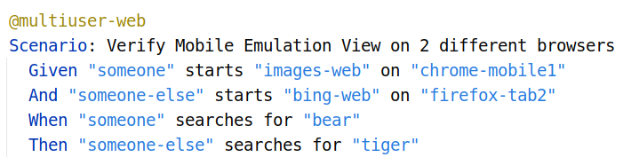

# Configuring the test execution

Test execution using teswiz is highly configurable. This enables you to control what type of tests you want to execute, and where (environment, local/cloud), etc.

See all the [Configuration parameters here](ConfigurationParameters-README.md)

### Run on Android

To run all the tests against the Android platform, run the following command:

    PLATFORM=android ./gradlew run

#### Run on Local devices:

The framework, by default, automatically figures out if there are multiple devices connected to the machine, and if so,
will run the tests in parallel

#### Run on pCloudy's Device Farm:

**To enable running the tests on pCloudy's Device Farm, the following additional environment variables need to be provided:**

* `RUN_IN_CI=true` - Default is `false`
* `CLOUD_USERNAME` - pCloudy username
* `CLOUD_KEY` - pCloudy password

Sample command:

    PLATFORM=android RUN_IN_CI=true CLOUD_USERNAME=myusername CLOUD_KEY=abcd1234abcd ./gradlew run

For other cloud configurations, refer here: https://github.com/AppiumTestDistribution/AppiumTestDistribution

### Run on iOS

    PLATFORM=iOS ./gradlew run

### Run on Windows

    PLATFORM=windows ./gradlew run

### Run on Web

    PLATFORM=web ./gradlew run

### Running Multi-User simulations

The framework now supports running multiuser scenarios. This means 1 cucumber scenario can orchestrate the interaction between multiple instances of the application-under-test in multiple platforms - ex: Android and Web

Example:

In the above example
You can run these tests as below:

#### To run tests on **android & web** platforms

    TAG=@multiuser-android-web

**_Current restriction - 1 android device & max 2 web browsers_**

#### To run tests on **web** platforms

    TAG=@multiuser-web-web 

**_Current restriction - max 2 web browsers_**

### Running Multi-User scenarios in Mobile Emulation View of Web Browsers

The framework now supports launching web browsers in Mobile Emulation View.
Instead of passing simple browser names in steps like 'chrome', 'firefox', etc,
you can pass more informative parameters like 'chrome-mobile1', 'safari-mobile2', etc

These informative parameters refer to Browser Config json file for actual device names

Example:

### Using a different apk for execution (Android):

To run tests using a specific apk (instead of the one specified in caps/capabilities.json, OR,
caps/pcloudy_capabilties.json, the following additional environment variable need to be provided:

* `APP_PATH='<path to apk>'`

Sample command:

    APP_PATH=~/Downloads/MyLatestApp.apk PLATFORM=android ./gradlew run

### Running a subset of tests:

To run a subset of tests, for a given platform, the following additional environment variables need to be provided:

* `TAG=@schedule` - This will run all tests tagged with the platform name provided, except tests tagged as "@wip"
* `TAG="@schedule and @signup"` - This will run all tests tagged with the name **schedule AND signup** for the platform
  name provided, except tests tagged as "@wip"
* `TAG="@schedule or @signup"` - This will run all tests tagged with the name **schedule OR signup** for the platform
  name provided, except tests tagged as "@wip"

Sample commands:

    PLATFORM=android TAG=@schedule ./gradlew run`

    PLATFORM=android TAG="@schedule and @signup" ./gradlew run`

    PLATFORM=android TAG="@schedule or @signup" ./gradlew run`