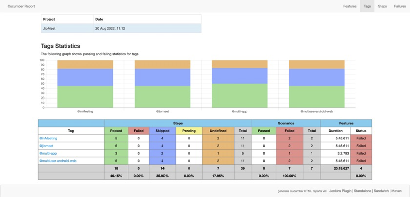

## Rich Reports using cucumber-reporting
teswiz creates rich reports for offline consuption using cucumber-reporting (https://github.com/damianszczepanik/cucumber-reporting)

These reports will be available in the following directory:

`LOG_DIR/mm-dd-yyyy/hh-mm-ss/reports/richReports/cucumber-html-reports/overview-features.html`

Example:

`~/teswiz/target/08-17-2022/17-36-02/reports/richReports/cucumber-html-reports/overview-features.html`

### Feature coverage
cucumber-reports has the ability to show tag statistics. This is very helpful to understand feature coverage from your automated tests.

Read more about this feature here: https://github.com/damianszczepanik/cucumber-reporting/blob/master/.README/tag-overview.png

You can find that report here:

`~/teswiz/target/08-17-2022/17-36-02/reports/richReports/cucumber-html-reports/overview-tags.html`

To exclude any tag(s) to be added in the rich reports, add the following line in your RunTestCukes.java

`System.setProperty(TEST_CONTEXT.TAGS_TO_EXCLUDE_FROM_CUCUMBER_REPORT, "@web,@android");`

## Sample Feature Coverage Report

