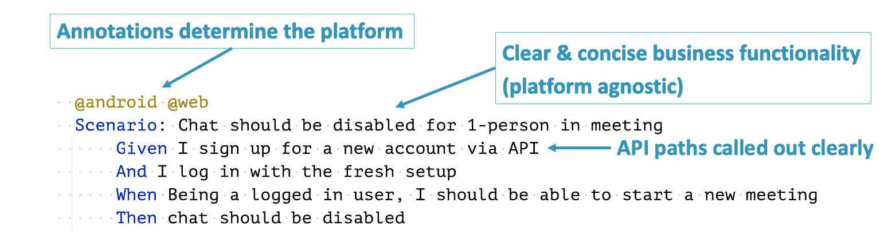
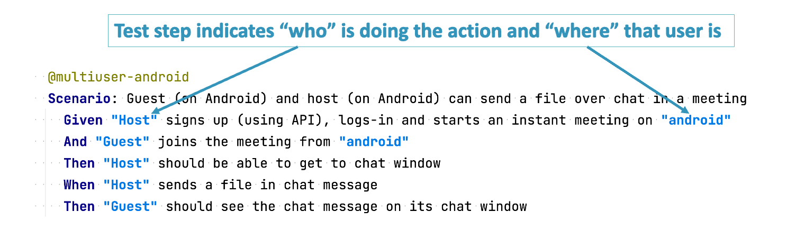
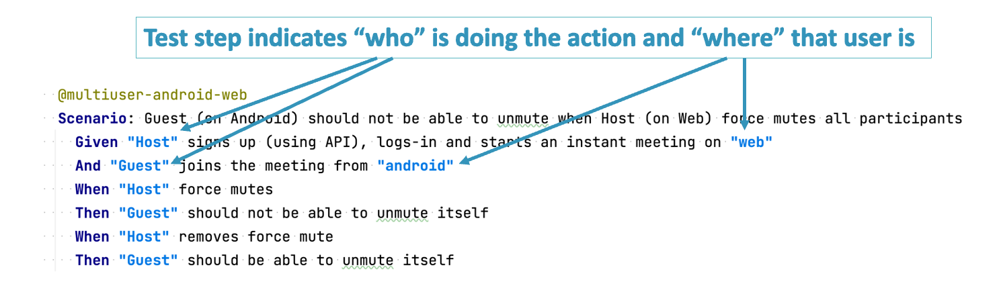
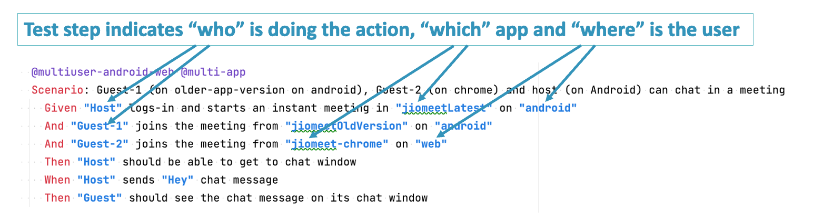

# Running the sample tests

### Android tests
  Example:

    CONFIG=./src/test/resources/configs/jiomeet_config.properties TAG="@jiomeet and @single-user" PLATFORM=android ./gradlew run 

  With Visual Testing enabled:

    CONFIG=./src/test/resources/configs/jiomeet_config.properties TAG="@jiomeet and @single-user" PLATFORM=android IS_VISUAL=true ./gradlew run

### Web tests
Example:

    CONFIG=./src/test/resources/configs/jiomeet_config.properties TAG="@jiomeet and @single-user" PLATFORM=web ./gradlew run 

  With Visual Testing enabled:

    CONFIG=./src/test/resources/configs/jiomeet_config.properties TAG="@jiomeet and @single-user" PLATFORM=web IS_VISUAL=true ./gradlew run

### Multiuser Android tests
  Example:

    CONFIG=./src/test/resources/configs/jiomeet_config.properties TAG="@jiomeet and @multiuser-android and @single-app" ./gradlew run

  With Visual Testing enabled:

    CONFIG=./src/test/resources/configs/jiomeet_config.properties TAG="@jiomeet and @multiuser-android and @single-app" IS_VISUAL=true ./gradlew run

### Multiuser Android-web tests
  Example:

    CONFIG=./src/test/resources/configs/jiomeet_config.properties TAG="@jiomeet and @multiuser-android-web and @single-app" ./gradlew run

  With Visual Testing enabled:

    CONFIG=./src/test/resources/configs/jiomeet_config.properties TAG="@jiomeet and @multiuser-android-web and @single-app" IS_VISUAL=true ./gradlew run

### Multiuser-Multiapp Android-web tests
Example:

    CONFIG=./src/test/resources/configs/jiomeet_config.properties TAG="@jiomeet and @multiuser-android-web and @multi-app" ./gradlew run

With Visual Testing enabled:

    CONFIG=./src/test/resources/configs/jiomeet_config.properties TAG="@jiomeet and @multiuser-android-web and @multi-app" IS_VISUAL=true ./gradlew run

### Multiuser-Multiapp Android tests
    CONFIG=./src/test/resources/configs/jiomeet_config.properties TAG="@jiomeet and @multiuser-android and @multi-app" ./gradlew run

  With Visual Testing enabled:

    CONFIG=./src/test/resources/configs/jiomeet_config.properties TAG="@jiomeet and @multiuser-android and @multi-app" IS_VISUAL=true ./gradlew run

