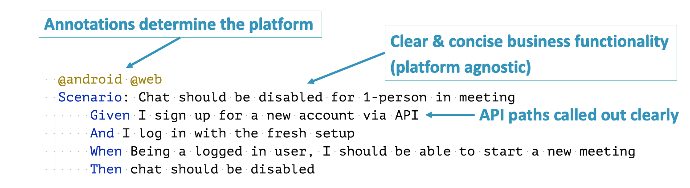
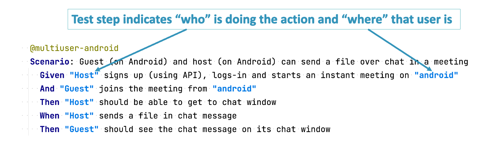
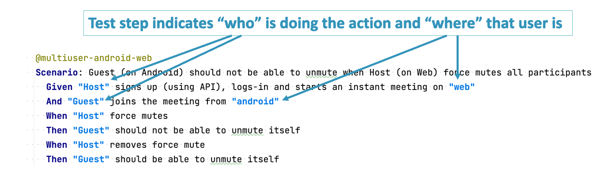
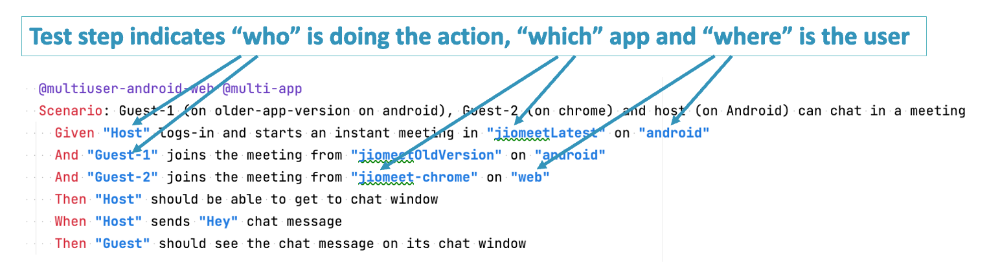

# Running the sample tests

## Playwright TS Phase 1 local feedback path

Use the existing TheApp feature for the first local Playwright feedback loop:

### 1. Single-user web

```bash
WEB_ENGINE=playwright-ts CONFIG=./configs/theapp/theapp_local_web_config.properties PLATFORM=web TAG="@theapp2 and @invalidLogin1 and @playwright-phase1" ./gradlew run
```

Scenario:

* [`src/test/resources/com/znsio/teswiz/features/theapp.feature`](../src/test/resources/com/znsio/teswiz/features/theapp.feature)
  * `@theapp2 @invalidLogin1 @playwright-phase1`

### 2. Multi-user web

```bash
WEB_ENGINE=playwright-ts CONFIG=./configs/theapp/theapp_local_web_config.properties PLATFORM=web TAG="@multiuser-web and @theapp7 and @playwright-phase1" ./gradlew run
```

Scenario:

* [`src/test/resources/com/znsio/teswiz/features/theapp.feature`](../src/test/resources/com/znsio/teswiz/features/theapp.feature)
  * `@multiuser-web @theapp7 @playwright-phase1`

### 3. Mixed platform (Appium Android + Playwright web)

```bash
WEB_ENGINE=playwright-ts CONFIG=./configs/theapp/theapp_local_android_config.properties TAG="@multiuser-android-web and @theapp5 and @playwright-phase1" ./gradlew run
```

Scenario:

* [`src/test/resources/com/znsio/teswiz/features/theapp.feature`](../src/test/resources/com/znsio/teswiz/features/theapp.feature)
  * `@multiuser-android-web @theapp5 @playwright-phase1`

Notes:

* `HEADLESS=true` is recommended for local Playwright framework verification.
* The mixed-platform scenario still requires the Android/Appium local prerequisites to be available.
* These are the recommended first scenarios before enabling visual validation or cloud execution.

### Android tests
  Example:



    CONFIG=./configs/jio/jiomeet_local_config.properties TAG="@jiomeet and @single-user" PLATFORM=android ./gradlew run 

  With Visual Testing enabled:

    CONFIG=./configs/jio/jiomeet_local_config.properties TAG="@jiomeet and @single-user" PLATFORM=android IS_VISUAL=true ./gradlew run

### Web tests
Example:


    CONFIG=./configs/jio/jiomeet_local_config.properties TAG="@jiomeet and @single-user" PLATFORM=web ./gradlew run 

  With Visual Testing enabled:

    CONFIG=./configs/jio/jiomeet_local_config.properties TAG="@jiomeet and @single-user" PLATFORM=web IS_VISUAL=true ./gradlew run

### Multiuser Android tests
  Example:



    CONFIG=./configs/jio/jiomeet_local_config.properties TAG="@jiomeet and @multiuser-android and @single-app" ./gradlew run

  With Visual Testing enabled:

    CONFIG=./configs/jio/jiomeet_local_config.properties TAG="@jiomeet and @multiuser-android and @single-app" IS_VISUAL=true ./gradlew run

### Multiuser Android-web tests
  Example:



    CONFIG=./configs/jio/jiomeet_local_config.properties TAG="@jiomeet and @multiuser-android-web and @single-app" ./gradlew run

  With Visual Testing enabled:

    CONFIG=./configs/jio/jiomeet_local_config.properties TAG="@jiomeet and @multiuser-android-web and @single-app" IS_VISUAL=true ./gradlew run

### Multiuser-Multiapp Android-web tests
Example:



    CONFIG=./configs/jio/jiomeet_local_config.properties TAG="@jiomeet and @multiuser-android-web and @multi-app" ./gradlew run

With Visual Testing enabled:

    CONFIG=./configs/jio/jiomeet_local_config.properties TAG="@jiomeet and @multiuser-android-web and @multi-app" IS_VISUAL=true ./gradlew run

### Multiuser-Multiapp Android tests
    CONFIG=./configs/jio/jiomeet_local_config.properties TAG="@jiomeet and @multiuser-android and @multi-app" ./gradlew run

  With Visual Testing enabled:

    CONFIG=./configs/jio/jiomeet_local_config.properties TAG="@jiomeet and @multiuser-android and @multi-app" IS_VISUAL=true ./gradlew run

### Electron tests

    IS_VISUAL=false CONFIG=./configs/jio/jiomeet_local_config.properties TAG="@jiomeet and @single-user" PLATFORM=electron ./gradlew run
