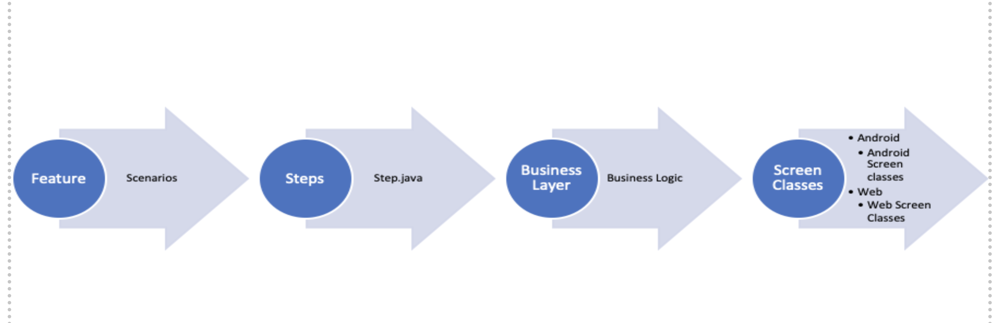
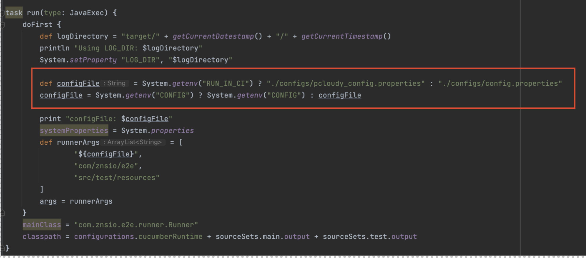

# Writing the first test

## Pre-requisites:

        1. Intellij (install cucumber JVM plugin)
        2. Java JDK 11 (JAVA_HOME Path Set)
        3. Appium version (minimum 1.20.0)
        4. Android studio (Android_Home Path Set)
        5. GIT
        6. Docker

## Flow understanding

    # Feature Files:    
            These are the files that contains the tests in BDD format with the tags related to 
            platform on which the tests will be running. Tags such as @android or @web etc. 
            Also, there can be more tags related to features can be added in feature level.
    
    # Steps File:
            These are files that have the definition of the steps that is used in feature files. 
            LOGGER can be added in each method. From steps file, there would be a call made to BL.
    
    # Business Layer:
            These files have assertions and business logics. BL contains the functionality.
            From the BL, there will be call made to screens or the APIs. This will be the logical 
            layer for the suite.
    
    # Screens: 
             Screen represents one particular screen of application or a snippet of the application.The screen
             files contains the locator and screen navigations.

    # Services: 
            These are the files that contain the API service calls required for pre-requisite data. 
    
    # Caps: 
            This directory contains the capabilities file contains details required to create a Appium 
            driver for android, iOS or windows device. It also could have details about the cloud-based
            device farm.

    # Configs: 
            The config.properties file has configuration details related to the execution of the tests such as 
            browser, parallel instances, enabling visual testing, running in CI etc. 

## Steps to writing and configure the first test case using teswiz:



1. Changes to be done in config files, Add my_web_config.properties file in ./configs directory as
   per the project or assignment requirement.\
   Refer to an existing config and capabilities file and update the value of platform.\
   ````
   PLATFORM=android/web
   ````
   Update the properties of the particular web that you want to open in the\
    ````
    ENVIRONMENT_CONFIG_FILE=./src/test/resources/environments.json
    BASE_URL_FOR_WEB=BASE_URL_WEB 
2. Changes in the environments.json \
   Update the BASE_URL_WEB in this file to launch the base url for the application.\
   Copy the content of already existing local_configs file and update the value of platform and
   BASE_URL_OF_WEB to web and your url key from environments.json file.
3. Updates in the build.gradle \
   Check the below path of the config.properties for local run.\
   Check the path for the properties file for the cloud provider configuration
   (./configs/pcloudy_config.properties) if running from local to the cloud devices
   when passing the environment variable RUN_IN_CI = true.
   
4. Add required test data in ./src/test/resources/testData.json such as user details.
5. Create a feature file in ./src/test/resources/com/znsio/sample/e2e/features directory.
   Ex: myFirstTest.feature
6. Add Feature and scenario in it.\
   Note: Scenario should be in declarative\
   For example:\
   ````
    Scenario: User should be able to change the mic settings
            Given I sign in as a registered "Host"
            And I start an instant meeting
            When I Unmute myself
            Then I should be able to Mute myself
7. Add A test step for the same in ./src/test/java/com/znsio/sample/e2e/steps.
8. Add the required BL methods in ./src/test/java/com/znsio/sample/e2e/businessLayer.
9. Add the required Screens for BL in ./src/test/java/com/znsio/sample/e2e/screen.
10. Terminal Run commands \
    (i). Running in local from terminal
   ````    
     PLATFORM=android TAG=@firstTest ./gradlew clean run 
   ````
(ii). Running in local to the cloud devices (Mobile)
   ````
     PLATFORM=android TAG=@firstTest RUN_IN_CI = true ./gradlew clean run 
   ````
    
    
            