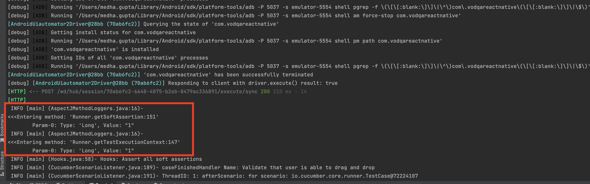

# Setting Up AspectJ auto logging with Teswiz:

With below AspectJ Local configurations, we can add auto logging for methods.

#### 1. Create a new aspect java class by using `@aspect` annotation before class name

```
@Aspect
public class AspectLogging {
    methodName(){}
}
```
#### 2. Add Pointcut to define the scope for auto-Logging using `@Pointcut` annotation
```
@Pointcut("execution(public * *.*(..))"")
    public void executionScope(){
    }
```
For more detail regarding pointcut visit: https://docs.spring.io/spring-framework/docs/2.0.x/reference/aop.html

#### 3. Add `@Before` and `@After` annotation to add loggers before and after method execution
```
    @Before("executionScope()")
    public void beforeAnyMethod(JoinPoint joinPoint) {
        AspectJMethodLoggers.beforeAnyMethod(joinPoint);
    }

    @After("executionScope()")
    public void afterAnyMethod(JoinPoint joinPoint) {
        AspectJMethodLoggers.afterAnyMethod(joinPoint);
    }
```

### Test Result
Once the AspectJ implementation is done execute a simple test case then observe the loggers in the console.


### teswiz's own two aspects

teswiz ships two separate aspects, each scoped to a different layer, logging at a different level:

| Aspect | Source set | Packages woven | Log level |
|---|---|---|---|
| `AspectLogging` | `src/main` (shipped in the published jar) | `entities`, `listener`, `runner`, `tools` — teswiz's own internal framework machinery | `DEBUG` (quiet by default; a consumer normally doesn't need to see this) |
| `ConsumerLayerAspectLogging` | `src/test` (teswiz-internal only, not shipped) | `steps`, `businessLayer`, `screen` — the layers a teswiz user actually authors | `INFO` (visible by default, since a user wants to see detail about their own implementation without enabling debug logging) |

Both aspects delegate their actual log formatting to the shared `AspectJMethodLoggers` helper, differing only in pointcut scope and log level.

Historically these two aspects had the **same class name** (`AspectLogging`) in both source sets. Because AspectJ's compile-time weaving resolves the aspect singleton by class name at runtime, and Gradle's test classpath puts `src/test` output ahead of `src/main` output, the `src/test` copy silently shadowed the `src/main` copy during `./gradlew test` — meaning only one aspect (`src/test`'s, at `INFO`) was ever actually active, regardless of which package a woven method belonged to. The `src/test` class was renamed to `ConsumerLayerAspectLogging` to fix this: the two aspects are now genuinely distinct and independently verifiable (see `AspectLoggingWeavingTest`).

Implementation reference:
- `src/main/java/com/znsio/teswiz/aspect/AspectLogging.java`
- `src/test/java/com/znsio/teswiz/aspect/ConsumerLayerAspectLogging.java`
