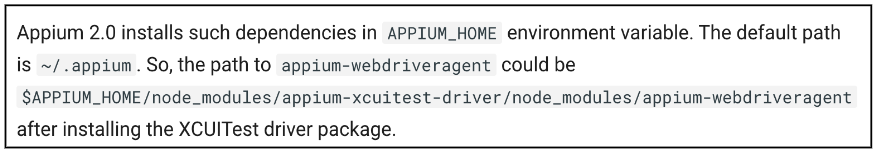
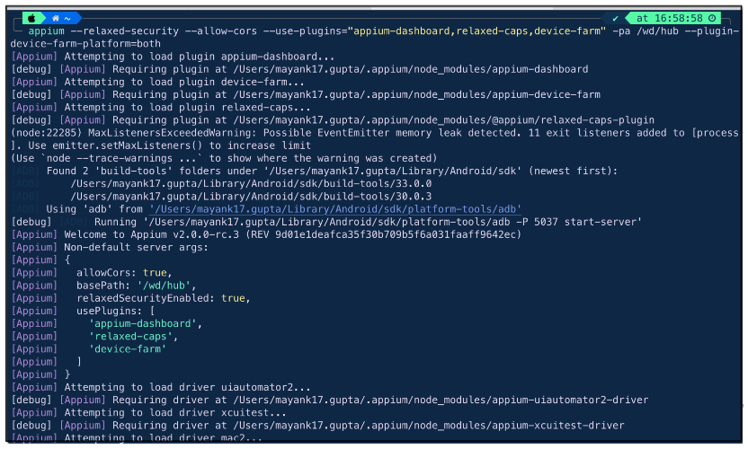
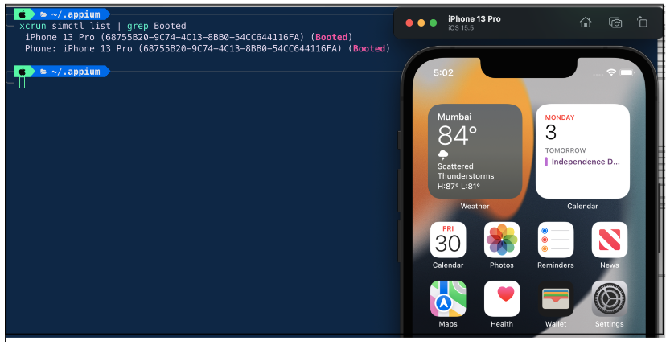
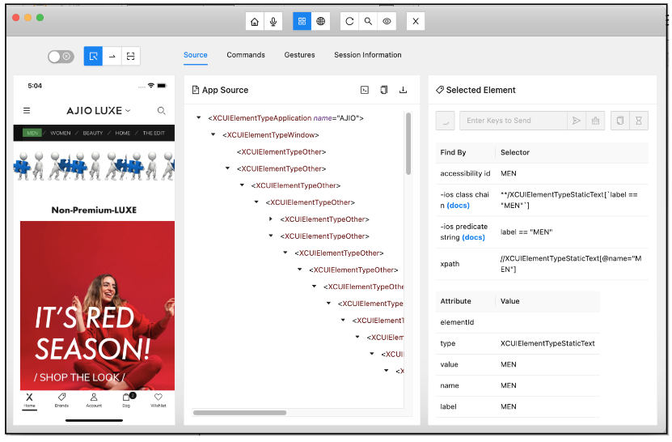

# Appium 2 – iOS Setup

<span style="font-size: larger;">This guide will walk you through the steps to set up Appium 2 for iOS.</span> 

1. Remove previous Appium 1.x installation if any.
## Install Appium 2

2. Install Appium 2 using the following command:
- ```npm i -g appium@next```


## Install Plugins


3. To install the Appium Device Farm and Appium Dashboard plugins, run the following commands.

* `appium plugin install --source=npm appium-device-farm`

* `appium plugin install --source=npm appium-dashboard`


4. Install plugin for Relaxing Appium's requirement for vendor prefixes on capabilities.

* `appium plugin install relaxed-caps`

   `appium plugin install --source=npm @appium/relaxed-caps-plugin`


## Install Drivers


5. Cross Platform installation, [click here](https://github.com/danielpaulus/go-ios), this is an operating system independent implementation of iOS device features. You can run UI tests, launch or kill apps, install apps etc. with it.
   MacOS users will need to install this driver to unzip files. To install the driver, run the following command
* `npm install -g go-ios`


6. The XCUITest driver is used to automate iOS apps that are written using Xcode. To install the driver, run the following command:

* `appium driver install xcuitest`

7. Verify XCUITest Driver installation path.
   


## Install and configure Appium Inspector


8. Latest [Appium Inspector](https://github.com/appium/appium-inspector/releases) supporting Appium 2


9. Appium Inspector [Capability guidelines and examples](https://appium.io/docs/en/2.0/guides/caps/)


## Start Appium


10. To start Appium, run the following command:

* `appium --relaxed-security --allow-cors --use-plugins="appium-dashboard,relaxed-caps,device-farm" -pa /wd/hub --plugin-device-farm-platform=both`

Please keep in mind that Teswiz will start the Appium 2 server and handle the necessary configurations.



## Connect your device or simulator


11. Once Appium is started, you can connect your iOS device or simulator.


12. Run following command to get Simulator/Device details:

* `xcrun simctl list | grep Booted`




## Connect Appium Inspector


13. You can connect Appium Inspector to your Appium session by opening the Appium Inspector app and entering the URL of your Appium server.





You are now ready to start automating your iOS apps!

For more information on Appium 2, please see the [Appium documentation.](https://appium.io/docs/en/2.0/) 

 