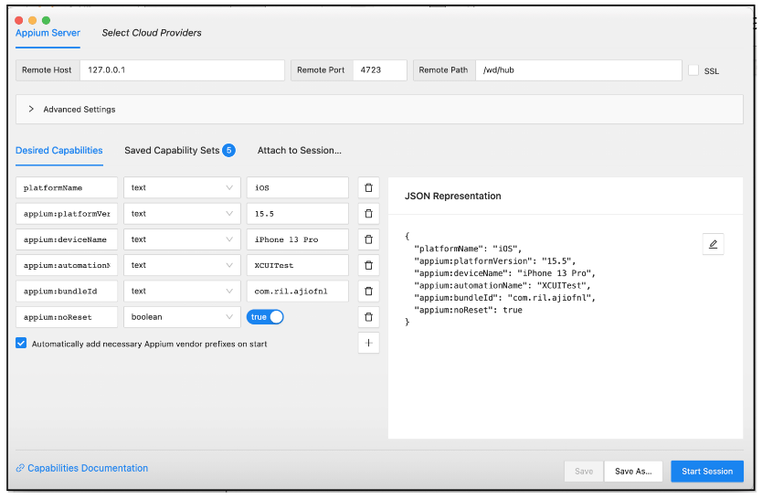

# Appium 2 – iOS Setup

Refer to the [Prerequisites](Prerequisites-README.md) document for general setup prerequisites.

This guide will walk you through the steps to set up Appium 2 for iOS. 

Verify XCUITest Driver installation path.
   

## Setting Variables for Project Setup
Set the **usePrebuiltWDA** capability to false in a capabilities file, you can use the following format:
    
    "usePrebuiltWDA": false

## Start Appium

To start Appium manually, run the following command:

    appium --relaxed-security --allow-cors --use-plugins="appium-dashboard,relaxed-caps,device-farm" -pa /wd/hub --plugin-device-farm-platform=both

**Please keep in mind that teswiz will start the Appium 2 server and handle the necessary configurations.**

## Connect your device or simulator

* Once Appium is started, you can connect your iOS device or simulator.
* Run following command to get Simulator/Device details:

  
    xcrun simctl list | grep Booted

## Connect Appium Inspector

* You can connect Appium Inspector to your Appium session by opening the Appium Inspector app and entering the URL of your Appium server.

You are now ready to start automating your iOS apps!

For more information on Appium 2, please see the [Appium documentation.](https://appium.io/docs/en/2.0/) 

 