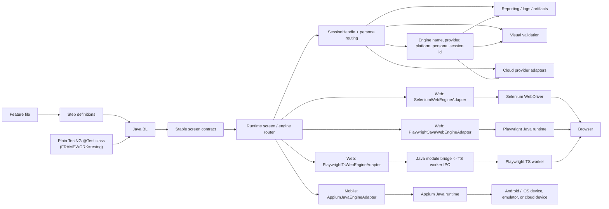
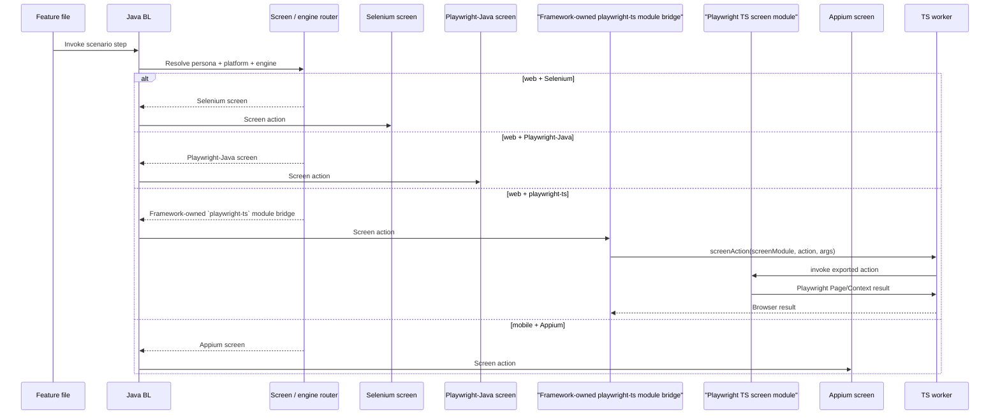
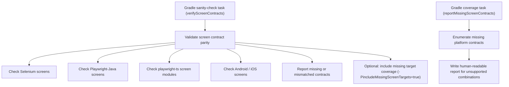

# teswiz Architecture Notes

This document is the design note for the current teswiz runtime shape.

Read this after the main [README](../../README.md) when you want to understand:

- how Selenium, Playwright-Java, Playwright-TS, and Appium fit together
- where persona routing and session ownership live
- how screen resolution works
- where provider, reporting, and visual responsibilities sit

For upgrade steps, use:

- [Breaking changes](BreakingChanges-README.md)
- [Playwright migration guide](Playwright-Migration-Guide.md)

This doc focuses on architecture, not migration.

## Engine architecture

teswiz treats web and mobile execution as first-class variants behind one shared business-facing contract.
The execution choice is persona-scoped and session-scoped, so multi-user scenarios can mix engines safely.

The complete runtime picture is:

Everything from the screen contract downward is identical regardless of entry point — Cucumber's feature/step-def layer and a plain TestNG `@Test` class both call the same Java BL, so engine routing, persona/session ownership, reporting, and visual validation behave the same either way. See `com.znsio.teswiz.testng` further down for the TestNG-mode-specific plumbing (mode selection, hooks, discovery, tag mapping, reporting).

Execution routing is still persona-scoped, and the same scenario can involve multiple engines or platforms:

Explicit sanity-check and migration-support tasks are part of the architecture:

Assumptions used by this architecture:

* the screen contract stays stable across supported platform and engine combinations
* the BL layer never calls TypeScript directly
* Playwright-TS remains a Java-owned orchestration path with a TS worker at the execution boundary
* test-owned Playwright-TS screen modules live under `src/test/resources/playwright/screens`
* `playwright-ts` screen resolution is module-based rather than Java-class-based
* `playwright-java` and `playwright-ts` should both be authored with native Playwright APIs in their engine-specific screen implementations
* Selenium-style locators and Selenium-style screen code are not the target authoring model for Playwright engines
* Selenium Java continues to work as it does today
* multi-user and multi-platform routing remains persona/session-driven
* engine-specific behavior belongs in engine-specific screen implementations, not in BL
* framework capabilities that are not real UI screens, such as PDF validation, should live in `src/main` framework classes rather than test-side screen contracts
* runtime screen resolution and user-facing screen verification/reporting infrastructure should ship from `src/main`, while sample contracts and framework self-tests can remain in `src/test`

## Pattern matrix

The dual-engine and multi-platform design intentionally uses a small set of patterns.
The table below maps each pattern to the current teswiz implementation and the planned end-state as Playwright-Java and Playwright-TS become first-class web engines.

| Pattern | Why teswiz uses it | Current teswiz examples | Planned / expanding examples |
| --- | --- | --- | --- |
| [Facade](https://refactoring.guru/design-patterns/facade) | Keep framework-facing entry points stable while hiding engine details | `Runner`, `Drivers`, `BrowserDriverManager`, `Visual` | Keep the same facade layer stable while web engines multiply |
| [Strategy](https://refactoring.guru/design-patterns/strategy) | Select engine or provider at runtime by config and platform | `WEB_ENGINE`, `WebExecutionProviderResolver`, `MobileExecutionProviderResolver` | `selenium`, `playwright-java`, `playwright-ts` as peer web strategies |
| [Adapter](https://refactoring.guru/design-patterns/adapter) | Normalize different runtimes behind the teswiz contract | `PlaywrightWebDriver`, `BrowserStackWebExecutionProvider`, `LambdaTestWebExecutionProvider` | `SeleniumWebEngineAdapter`, `PlaywrightJavaWebEngineAdapter`, `PlaywrightTsWebEngineAdapter`, Appium-side mobile adapters |
| [Proxy / Remote Proxy](https://refactoring.guru/design-patterns/proxy) | Let Java call Playwright-TS while execution happens in a separate worker | `PlaywrightWorkerClient`, `PlaywrightWorkerManager`, TS worker IPC | Keep Playwright-TS as a Java-owned orchestration path with a remote execution boundary |
| [Factory](https://refactoring.guru/design-patterns/factory-method) | Create engine-specific sessions and screen implementations without exposing creation logic to tests | `Drivers.createDriverFor(...)`, `ScreenRegistry.getScreen(...)`, `PlaywrightWorkerManager.createManagedSession(...)` | Config-driven screen factories and engine factories for Selenium, Playwright-Java, Playwright-TS, and Appium |
| [Abstract Factory](https://refactoring.guru/design-patterns/abstract-factory) | Choose the correct family of screen implementations for a given platform and engine | Partially present today in screen `get()` methods and platform branching | Explicit engine-aware screen factories for shared screen contracts |
| [Bridge](https://refactoring.guru/design-patterns/bridge) | Keep the business-facing screen contract stable while allowing different underlying engine implementations | Current screen abstractions plus platform-specific screen classes | Shared screen contract implemented by Selenium, Playwright-Java, Playwright-TS, Android, and iOS variants |
| [Session Object](https://martinfowler.com/eaaCatalog/serverSessionState.html) | Route personas through explicit session metadata instead of raw driver ownership | `SessionHandle`, `UserPersonaDetails` | Expand session-aware routing uniformly across Selenium, Playwright-Java, Playwright-TS, Appium, and cloud providers |
| [DTO / Result Object](https://martinfowler.com/eaaCatalog/dataTransferObject.html) | Return engine-created runtime state without letting engine packages own framework objects | `WebDriverSessionResult` | Similar result objects for engine session creation and artifact capture where needed |
| [Ports and Adapters](https://alistair.cockburn.us/hexagonal-architecture) | Keep the Java core as the orchestration layer and push vendor/runtime specifics to the edges | `web.provider`, `mobile.provider`, Playwright worker bridge, browser/provider/session packages | Stronger engine-boundary contracts for Selenium, Playwright-Java, Playwright-TS, Appium, and cloud providers |
| [Dependency Injection](https://martinfowler.com/articles/injection.html) via functions / suppliers | Make internal seams testable without turning concrete helpers into extension points | `PlaywrightWorkerManager` injected worker factory, browser-config lookup, provider-name supplier | Continue replacing subclass-based test seams with smaller injected contracts |
| [Contract verification](https://martinfowler.com/bliki/ContractTest.html) | Prevent engine or platform implementations from drifting away from the shared screen/business contract | Focused shared web-driver contract tests today | Planned Gradle sanity-check task for engine/platform screen contract parity |

Patterns teswiz is intentionally moving away from:

* inheritance-heavy extension seams for internal helpers
* hidden mutable context side effects for engine/session transfer
* engine-specific behavior leaking into BL classes
* giant all-purpose interfaces instead of smaller, composable engine contracts

## Upgrade and migration impact

* Existing Selenium Java tests continue to run unchanged
* No migration script is required for Selenium-only suites
* Playwright Java and Playwright TS adoption is opt-in
* If a suite wants to use a Playwright engine, it must select the engine explicitly and use the corresponding native Playwright screen implementation
* If a suite stays on Selenium Java, no code or configuration migration is needed beyond keeping its current config in place

## Stable framework-facing package

`com.znsio.teswiz.runner`

Keep these as the primary framework entry points unless there is a deliberate breaking-change decision:

* `Driver`
* `Drivers`
* `Runner`
* `Setup`
* `Visual`

These classes act as the stable Java-owned orchestration layer for:

* scenario lifecycle
* driver/session orchestration
* config access
* visual orchestration
* integration points already used by client projects

## Internal support packages

### `com.znsio.teswiz.session`

Owns session metadata and persona/session registries.

Current examples:

* `SessionHandle`
* `UserPersonaDetails`

### `com.znsio.teswiz.config.browser`

Owns browser-config parsing and Playwright-specific browser-config evolution.

Current examples:

* `BrowserConfigLoader`
* `PlaywrightBrowserConfig`
* `PlaywrightBrowserConfigResolver`
* `PlaywrightBrowserConfigMigrator`
* `PlaywrightBrowserConfigMigrationReporter`

### `com.znsio.teswiz.config.app`

Owns shared app artifact path resolution, version detection, and download handling so Android, iOS, and Windows setup flows can
reuse the same behavior without keeping the implementation inside `runner`.

Current examples:

* `AppPathResolver`
* `AppVersionDetector`

### `com.znsio.teswiz.config.capability`

Owns shared capability lookup and device-farm capability-file persistence so runner and provider setup code do not
need to keep JSON-path and file-rewrite logic inline.

Current examples:

* `CapabilityConfigResolver`
* `CapabilityFileManager`

### `com.znsio.teswiz.mobile.provider`

Owns provider-aware mobile execution behavior extracted from Appium orchestration, including cloud setup,
cleanup, capability shaping, upload helpers, and report-link publication.

Current examples:

* `MobileExecutionProvider`
* `MobileCloudExecutionManager`
* `BrowserStackMobileSetup`
* `LambdaTestMobileSetup`
* `HeadSpinMobileSetup`
* `PCloudyMobileSetup`
* `BrowserStackDevice`
* `BrowserStackDeviceFilter`

### `com.znsio.teswiz.mobile.session`

Owns internal Appium device-session state and registries so mobile runtime metadata can move out of `runner`
without changing the stable orchestration-facing entry points.

### `com.znsio.teswiz.mobile.device`

Owns local mobile device and simulator discovery and parallel-availability validation so local Appium setup can move
out of `runner` while setup entry points remain stable.

### `com.znsio.teswiz.mobile.server`

Owns internal Appium local-server lifecycle and remote hub URL normalization so Appium runtime plumbing can move
out of `runner` while stable orchestration delegates remain intact.

Current examples:

* `AppiumServerController`
* `MobileExecutionProviderResolver`
* `LocalMobileExecutionProvider`
* `BrowserStackMobileExecutionProvider`
* `LambdaTestMobileExecutionProvider`
* `HeadSpinMobileExecutionProvider`
* `PCloudyMobileExecutionProvider`
* `LambdaTestMobileAppUpload`
* `BrowserStackMobileCapabilitySetup`
* `HeadSpinMobileCapabilitySetup`
* `LambdaTestMobileCapabilitySetup`
* `PCloudyMobileCapabilitySetup`

### `com.znsio.teswiz.web`

Owns shared web-engine concepts.

Current examples:

* `WebEngine`

### `com.znsio.teswiz.web.provider`

Owns provider-aware web execution behavior such as session naming, status updates, and provider identity for local and cloud runs.

Current examples:

* `WebExecutionProvider`
* `WebExecutionProviderResolver`
* `LocalWebExecutionProvider`
* `BrowserStackWebExecutionProvider`
* `LambdaTestWebExecutionProvider`
* `HeadSpinWebExecutionProvider`
* `WebCloudSessionMetadataResolver`
* `WebSessionMetadataBuilder`

### `com.znsio.teswiz.web.provider.selenium`

Owns Selenium-specific cloud capability setup extracted from `runner` so provider-specific web capability building can evolve without bloating orchestration classes.

Current examples:

* `BrowserStackWebSetup`
* `LambdaTestWebSetup`
* `BrowserStackWebCapabilitySetup`
* `LambdaTestWebCapabilitySetup`
* `SeleniumRemoteWebDriverRequestResolver`
* `SeleniumRemoteWebDriverRequest`

### `com.znsio.teswiz.web.provider.playwright`

Owns normalized provider-aware Playwright execution configuration so `playwright-java` and `playwright-ts` can receive the same provider metadata and endpoint details without pushing cloud conditionals back into `runner`.

Current examples:

* `PlaywrightExecutionProviderConfig`
* `PlaywrightExecutionProviderConfigResolver`

### `com.znsio.teswiz.web.browser`

Owns browser-engine orchestration that chooses Selenium or Playwright web execution.

Current examples:

* `BrowserDriverManager`
* `WebDriverSessionResult`

### `com.znsio.teswiz.web.selenium`

Owns Selenium web engine runtime internals used by teswiz.

Current examples:

* `SeleniumDriverManager`

### `com.znsio.teswiz.web.playwright`

Owns the Playwright TS worker bridge and Selenium-compatible driver facade used internally by teswiz.

Current examples:

* `PlaywrightWorkerClient`
* `PlaywrightWorkerManager`
* `PlaywrightWorkerResponse`
* `PlaywrightWorkerSession`
* `PlaywrightWebDriver`
* `PlaywrightWebElement`
* `PlaywrightLocator`
* `PlaywrightLocatorReference`

### `com.znsio.teswiz.reporting`

Owns reporting-side adapters that turn engine/session state into uniform teswiz artifacts.

Current examples:

* `ScenarioArtifactReporter`

Current reporting behavior includes:

* `scenario-session-metadata.json` for per-scenario session metadata
* `scenario-session-summary.txt` for quick human-readable session summaries
* shared publication of Selenium browser logs, Playwright trace/HAR/console artifacts, and Appium device logs
* ReportPortal log messages for web cloud provider report links when session metadata includes provider-native report details
* HTML report classifications aggregated from scenario metadata, including personas, platforms, engines, providers,
  and when available, provider-native cloud session ids, report URLs, and normalized provider artifact URLs

### `com.znsio.teswiz.visual`

Owns engine-specific visual helper implementations that support `runner.Visual`.

Current examples:

* `PlaywrightVisualCheckSettingsMapper`

### `com.znsio.teswiz.testng`

Owns the alternative, non-Cucumber execution mode: consumers write plain TestNG `@Test` classes that call the same business-layer/screen classes Cucumber step defs call, skipping the Gherkin/step-def translation layer entirely. Selected via the `FRAMEWORK` config property (`cucumber` default, or `testng`); `Runner.run(...)` forks between the two modes based on `Setup.isTestNgExecutionMode()`. A project may contain both Cucumber and TestNG-mode code, but a single execution runs only one mode.

Current examples:

* `TestNgRunner` — programmatic `org.testng.TestNG` bootstrap (test classes, groups, parallel mode, thread count, report output directory), entirely in code with no `testng.xml`
* `TeswizTestNgListener` — wires TestNG's `ITestListener` lifecycle to `Hooks`, mirroring what `RunCukes`'s Cucumber `@Before`/`@After` do
* `TestNgTestExecutionContextFactory` — per-test directory scaffolding (screenshot/log directories) equivalent to `CucumberScenarioListener.scenarioStartedHandler`, since `Hooks`/`ScreenShotManager` assume this state exists regardless of mode
* `TestNgTestClassDiscovery` — `org.reflections`-based classpath scanning for `@Test`-annotated classes, the TestNG-mode equivalent of Cucumber's `--glue` package scanning
* `TestNgTagExpressionParser` / `TestNgGroupSelection` — translates the same `TAG` config Cucumber mode uses into TestNG include/exclude groups, supporting `and`/`not`/`or`; a true AND of two positive tags is rejected (TestNG's group model can't express it) rather than silently mishandled
* `TestNgExecutionResult` / `TestNgGroupCoverage` — the outcome of a TestNG-mode run: overall passed/failed counts (feeding the same hard-gate truth table `Runner.getStatus` already uses for Cucumber mode) plus a per-TestNG-group breakdown of which tests passed/failed
* `TestNgTagCoverageReportWriter` — renders `TestNgGroupCoverage` as a lightweight, dependency-free HTML table (Group | Total | Passed | Failed), written alongside TestNG's own `EmailableReporter2` output
* `TestNgStepRecorder` / `TestNgCapturedStep` — `ThreadLocal`-based capture buffer for business-layer/screen/steps method calls, populated by the `TestNgStepCaptureAspect` woven around the same package pointcut as `ConsumerLayerAspectLogging` (`&& !within(*..*$AjcClosure*)` to exclude AspectJ's own generated closure classes, needed since this advice is `@Around`), gated by `Setup.isTestNgExecutionMode()` (a no-op in Cucumber mode). Each captured call becomes one synthetic Cucumber-style "step", recorded at call **start** (`beginStep`/`endStep`) with a per-thread nesting depth, so the report reflects the real call sequence and hierarchy (test → BL → screen → ...) rather than a completion-order trace
* `TestNgScenarioReportData` / `TestNgCucumberJsonBuilder` / `TestNgCucumberStyleReportWriter` — assembles captured steps into a synthetic Cucumber-JSON document (the same schema real Cucumber runs produce, including a `match.location` per step so masterthought's Steps Statistics page groups correctly) and feeds it through the same `net.masterthought:cucumber-reporting` `Configuration`/`ReportBuilder` API `CustomReports` uses for Cucumber mode, producing the same rich Bootstrap/Chart.js HTML report site (tag/feature drill-downs, collapsible step trees) for TestNG-mode runs. Nested step names are indented (non-breaking spaces + a `↳` marker) per depth level to visualize the call hierarchy

Reporting note: TestNG mode uses TestNG's own built-in `EmailableReporter2` (a flat per-test HTML summary), a custom lightweight coverage-by-tag HTML report (`TestNgTagCoverageReportWriter`), and a rich masterthought-powered report (`TestNgCucumberStyleReportWriter`) built from synthetic Cucumber JSON assembled at runtime from captured business-layer calls — all three are written into the same `testngHtmlReport` output directory on every run. Hard-gate semantics (`SET_HARD_GATE`/`IS_FAILING_TEST_SUITE`) work identically in both modes, feeding the same `Runner.getStatus` truth table. ReportPortal integration for TestNG mode was investigated and found blocked on a genuine upstream `agent-java-testng`/`client-java` binary incompatibility — deferred, not built. See `docs/internals/TestNG-Execution-Mode-Plan.md` for the full implementation history, decisions, and open items.

## Package rules

When adding new code for the dual-engine architecture:

* do not dump new engine-specific support classes into `runner` by default
* keep `runner` focused on stable orchestration-facing APIs
* prefer browser-engine orchestration code under `web.browser`
* prefer Selenium web engine code under `web.selenium`
* prefer engine-specific code under `web.playwright`
* prefer provider-specific web execution code under `web.provider`
* prefer Selenium web cloud capability setup under `web.provider.selenium`
* prefer Appium device-session state under `mobile.session`
* prefer local mobile device and simulator setup under `mobile.device`
* prefer Appium server lifecycle and hub URL normalization under `mobile.server`
* prefer provider-specific Appium/mobile cloud behavior under `mobile.provider`
* prefer reporting adaptation code under `reporting`
* prefer shared app-path resolution, version detection, and download handling under `config.app`
* prefer shared capability lookup and capability-file persistence under `config.capability`
* prefer browser-config evolution code under `config.browser`
* prefer visual-engine adaptation code under `visual`

## Consumer compatibility intent

The goal is to keep teswiz non-breaking for normal Selenium Java users by preserving:

* feature-file style
* config keys
* execution flow
* stable `runner` entry points

Client projects should avoid importing internal support packages unless teswiz explicitly documents them as supported extension APIs.
